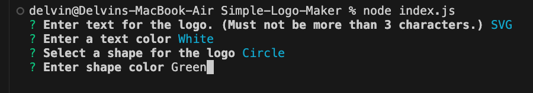
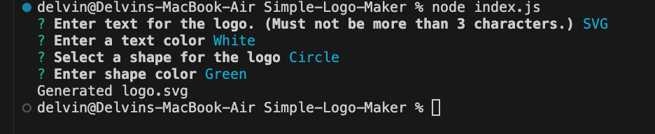
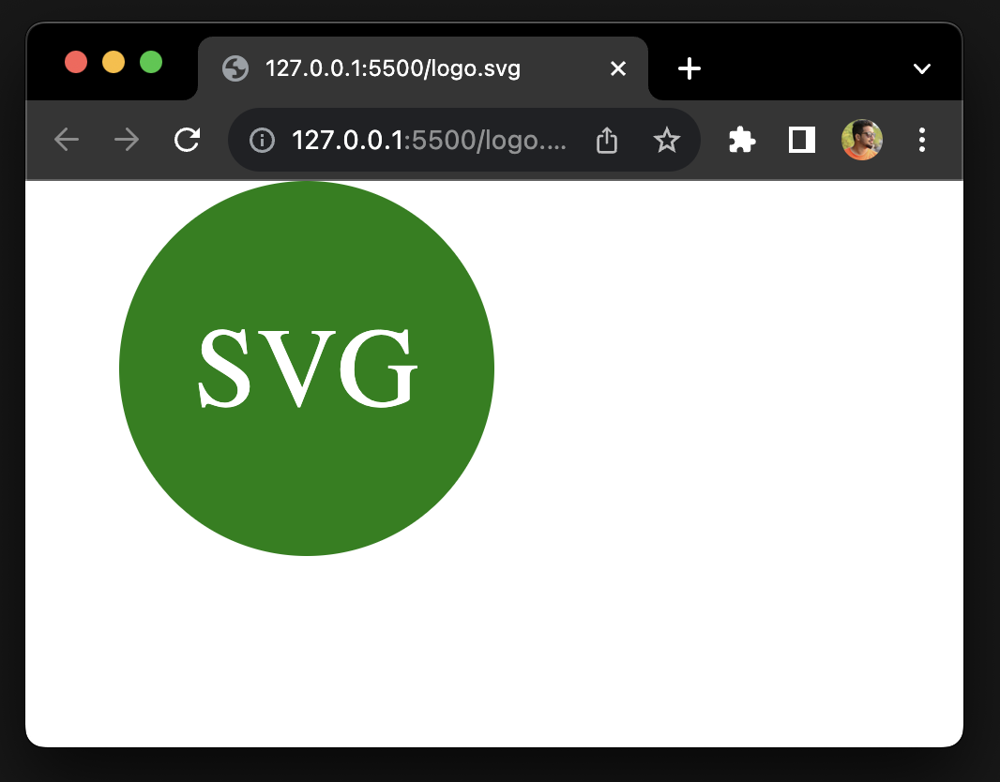

# Simple-Logo-Maker

## Description

This app is used to create a simple logo with inputs from user.

## Table of Contents

* [Installation](#installation)

* [Usage](#usage)

* [Walkthrough](#walkthrough)

* [Credits](#credits)
  
* [License](#license)

* [Contributing](#contributing)

* [Tests](#tests)

* [Questions](#questions)

## Installation

To install the necessary dependencies, run the following command:

npm i

## Usage 

Open the main folder in integrated terminal and install the dependencies once done run the index.js file using node index.js to run the project.

  
Once you run index.js a series of questions will be asked, answer accordingly.

Once done "Generated logo.svg" message will be shown in terminal.

The generated readme file can be accessed from main folder.

## Walkthrough

Find below walkthrough video link:

https://drive.google.com/file/d/1S0FlQzqncTSzKaqIYuI59NS0lm22HPnH/view?usp=sharing

## Credits

N/A

## License

This project is licensed under the MIT license.

## Contributing

Anyone is free to contribute

## Tests

To run tests, run the following command:

npm test

## Questions

If you have any questions about the repo, open an issue or contact me directly at write2delvin@gmail.com. You can find more of my work at [delve-in](http://github.com/delve-in/).
